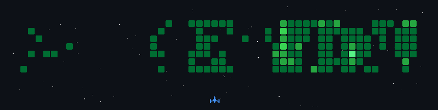

<!-- Heading -->

  
  

    
    
    
    
    
  

  

    
    
    
    
  

  

<!-- About Me -->

  <h1>🧑‍💻 About Me</h1>
  <table align="center">
    <tr>
      <td align="center"> <b>B.Tech CSE & Design</b></td>
      <td align="center"> <b>Full Stack Engineer</b></td>
      <td align="center"> <b>LeetCode Guardian</b></td>
      <td align="center"> <b>300+ DSA Problems</b></td>
      <td align="center"> <b>GATE Qualified</b></td>
      <td align="center"> <b>Production Apps</b></td>
    </tr>
  </table>
  <pre align="center" style="background: #0d1117; padding: 10px; border-radius: 10px; color: #e6edf3; font-family: 'Fira Code', monospace; width: 700px;">
                                      ┌────────────────────────────────────────────┐
  🌍 Shipping code from Noida, India  │  ███╗   ██╗██╗██╗  ██╗██╗  ██╗██╗██╗      │
  🚀 Building Scalable Projects       │  ████╗  ██║██║██║ ██╔╝██║  ██║██║██║      │
  💻 Cloud Computing & Linux User     │  ██╔██╗ ██║██║█████╔╝ ███████║██║██║      |
  ⚡ GATE CSIT 2027 Qualified         │  ██║╚██╗██║██║██╔═██╗ ██╔══██║██║██║      |
  🎯 Open-source & Hackathons Veteran │  ██║ ╚████║██║██║  ██╗██║  ██║██║███████╗ │
  🕹️ Gaming & AI/ML Enthusiast        │  ╚═╝  ╚═══╝╚═╝╚═╝  ╚═╝╚═╝  ╚═╝╚═╝╚══════╝ │
                                      └────────────────────────────────────────────┘
  </pre>
  
  

<!-- GitHub Stats -->

  <h1>📊 GitHub Stats</h1>
   
  

    
      
    
    
    
  

   
  <picture>
    <source media="(prefers-color-scheme: dark)" srcset="https://raw.githubusercontent.com/walidbosso/walidbosso/pacman/pacman-contribution-graph-dark.svg">
    <source media="(prefers-color-scheme: light)" srcset="https://raw.githubusercontent.com/walidbosso/walidbosso/pcman/pacman-contribution-graph.svg">
    
  </picture>
  

<!-- Coding Activity -->

  <h1>📈 Coding Activity</h1>
   
  
    
  <pre align="center" style="background: #0d1117; padding: 10px; border-radius: 10px; color: #e6edf3; font-family: 'Fira Code', monospace; width: 600px;">
┌────────────────────────────────────────────────────────────────┐
│  📅 WEEKLY DEVELOPMENT BREAKDOWN                               │
├────────────────────────────────────────────────────────────────┤
│  ████████████████░░░░░░░░░░░░░░░░░░  C++           5 hrs 45 min│
│  ██████████████████░░░░░░░░░░░░░░░░  DSA           5 hrs 30 min│
│  ████████████░░░░░░░░░░░░░░░░░░░░░░  Python        5 hrs 20 min│
│  ███████████░░░░░░░░░░░░░░░░░░░░░░░  JavaScript    3 hrs 00 min│
│  ████████░░░░░░░░░░░░░░░░░░░░░░░░░░  Java          3 hrs 15 min│
│  ██████░░░░░░░░░░░░░░░░░░░░░░░░░░░░  DevOps        2 hrs 30 min│
│  ████░░░░░░░░░░░░░░░░░░░░░░░░░░░░░░  AI/ML         2 hrs 45 min│
|  ██████░░░░░░░░░░░░░░░░░░░░░░░░░░░░  Cloud         2 hrs 30 min│
└────────────────────────────────────────────────────────────────┘
🔥 ACTIVE STREAK: 60 DAYS    ⚡ TOTAL: 30 HRS    🎯 PROBLEMS: 400+
  </pre>
  

<!-- Experience -->

  <h1>💼 Professional Experience</h1>
   
  <table align="center" width="700px">
    <tr align="left">
      <th width="35%">Role & Company</th>
      <th width="25%">Duration</th>
      <th width="45%">Key Achievements</th>
    </tr>
    <!-- Open source -->
    <tr>
      <td>🌟 <b>Open-Source Developer</b> <i>@ GitHub</i></td>
      <td>Mar 2026 – Present</td>
      <td>• 10+ contributions across repos • 5,000+ stars on projects • Maintainer of 2 popular libraries</td>
    </tr>
    <tr>
      <td>👨‍🎓 <b>GATE CSIT 2027 Qualified</b> <i>@ IIT Madras</i></td>
      <td>Feb 2027</td>
      <td>• Secured top percentile rank • Demonstrated strong CS fundamentals • Validated problem-solving skills</td>
    </tr>
    <tr>
      <td>🌐 <b>Web Development Intern</b> <i>@ Geeks Kepler</i></td>
      <td>Nov 2025 – Jan 2026</td>
      <td>• Responsive UI/UX components • Agile + Git workflows • Cross-browser optimization</td>
    </tr>
    <tr>
      <td>🌟 <b>Open-Source Developer</b> <i>@ GoFr & GSSoC</i></td>
      <td>Jun 2025 – Sep 2025</td>
      <td>• JWT authentication dashboards • Production-ready backend APIs • Code reviews & documentation</td>
    </tr>
    <tr>
      <td>👨‍💻 <b>Software Engineer</b> <i>@ WeBuiltU</i></td>
      <td>Jan 2025 – Jun 2025</td>
      <td>• Docker CI/CD → 40% faster releases • Query optimization → 35% latency drop • MERN + JWT RBAC implementation</td>
    </tr>
    <tr>
      <td>🚀 <b>Full Stack Freelancer</b> <i>@ Self-Employed</i></td>
      <td>Jan 2024 – Dec 2024</td>
      <td>• Razorpay + JWT integration • 50% server load reduction • Cloud deployment & maintenance</td>
    </tr>
  </table>
  

<!-- Technical Stack -->

  <h1>🛠️ Technical Arsenal</h1>
  
<b>Core Languages & Databases</b>

  
  
<b>Frontend & Design</b>

   
  
<b>Backend, Cloud & DevOps</b>

  
  
<b>AI/ML & Tools</b>

  
    
  

    
    
    
    
    
  

  

<!-- Projects -->

  <h1>🚀 Flagship Projects</h1>
  <table align="center">
    <tr>
      <td width="50%" valign="top">
        <h3 align="center">🌍 Global Watch</h3>
        

          
          
        

        
<b>TypeScript · AI · Maps · Data Streams</b>

        <ul>
          <li>✅ Real-time global intelligence dashboard for monitoring geopolitics, markets, and infrastructure.</li>
          <li>✅ AI-driven summaries, interactive maps, & hundreds of live data sources.</li>
        </ul>
      </td>
      <td width="50%" valign="top">
        <h3 align="center">⚖️ Legal Mitra</h3>
        

          
          
        

        
<b>TypeScript · Next.js · NestJS · PostgreSQL · Redis</b>

        <ul>
          <li>✅ Monorepo for LegalMitra: AI-assisted digital justice platform with blockchain-secured infrastructure.</li>
          <li>✅ Robust case, evidence, and workflow management for digital legal processes.</li>
        </ul>
      </td>
    </tr>
    <tr>
      <td width="50%" valign="top">
        <h3 align="center">🛒 Project Bazaar</h3>
        

          
          
        

        
<b>TypeScript · Next.js · Web Tools</b>

        <ul>
          <li>✅ Platform for project discovery, management, and showcasing.</li>
          <li>✅ Responsive UI, secure authentication, modern toolchain.</li>
        </ul>
      </td>
      <td width="50%" valign="top">
        <h3 align="center">🎟️ QR-Based Ticketing System</h3>
        

          
          
        

        
<b>React · Next.js · Node.js · Express · MongoDB</b>

        <ul>
          <li>✅ 30% reduction in check-in time</li>
          <li>✅ Offline validation support</li>
        </ul>
      </td>
    </tr>
    <tr>
      <td width="50%" valign="top">
        <h3 align="center">💸 Budget Management</h3>
        

          
          
        

        
<b>JavaScript · Next.js · PostgreSQL · AI</b>

        <ul>
          <li>✅ AI-powered app for budgeting & expense management.</li>
          <li>✅ Smart insights, spending analytics, and multi-provider support.</li>
        </ul>
      </td>
      <td width="50%" valign="top">
        <h3 align="center">📈 Stock Tracker</h3>
        

          
          
        

        
<b>TypeScript · Next.js · MongoDB</b>

        <ul>
          <li>✅ Web app for stock tracking, watchlists, and financial dashboards.</li>
          <li>✅ Automated updates, real-time data, and personalized reports.</li>
        </ul>
      </td>
    </tr>
  </table>
  

<!-- Achievements -->

  <h1>🏆 Achievements & Milestones</h1>
  <table align="center" width="700px">
    <tr>
      <td align="center" width="50%"><b>🗡️ LeetCode Guardian</b></td>
      <td width="50%">Top 1% globally • 300+ DSA problems solved</td>
    </tr>
    <tr>
      <td align="center"><b>🚀 GATE CSIT 2027 Qualified</b></td>
      <td>Secured top percentile rank among 100,000+ candidates</td>
    </tr>
    <tr>
      <td align="center"><b>🥇 SIH Finalist</b></td>
      <td>Smart India Hackathon 2024 • 6-member team lead</td>
    </tr>
    <tr>
      <td align="center"><b>🎖️ NDA SSB Merit</b></td>
      <td>All-India Rank in final merit list</td>
    </tr>
    <tr>
      <td align="center"><b>👥 Co-Founder</b></td>
      <td>WeBuilt_U • Technical leadership</td>
    </tr>
    <tr>
      <td align="center"><b>🌟 Open Source</b></td>
      <td>Active contributor @ GoFr, GSSoC</td>
    </tr>
    <tr>
      <td align="center"><b>🚀 Production Scale</b></td>
      <td>10+ robust applications deployed</td>
    </tr>
    <tr>
      <td align="center"><b>💰 Transaction Scale</b></td>
      <td>6,000+ monthly transactions processed</td>
    </tr>
    <tr>
      <td align="center"><b>🎯 Hackathons</b></td>
      <td>6+ participations with multiple wins</td>
    </tr>
  </table>
  

<!-- Certifications -->

  <h1>🎓 Certifications</h1>
  <table align="center" width="700;">
    <tr align="left">
      <th width="25%">Domain</th>
      <th width="50%">Certification</th>
      <th width="20%">Issuer</th>
    </tr>
    <tr>
      <td>🗄️ <b>Database</b></td>
      <td>MongoDB Associate Database Administrator</td>
      <td>MongoDB</td>
    </tr>
    <tr>
      <td>☁️ <b>Cloud</b></td>
      <td>Oracle Cloud Infrastructure AI Foundations Associate</td>
      <td>Oracle</td>
    </tr>
    <tr>
      <td>🔒 <b>Security</b></td>
      <td>ISO/IEC 27001 Information Security Associate</td>
      <td>ISO</td>
    </tr>
    <tr>
      <td>⚙️ <b>IT Service</b></td>
      <td>ISO 20000 IT Service Management Associate</td>
      <td>ISO</td>
    </tr>
    <tr>
      <td>🧪 <b>Testing</b></td>
      <td>Professional Diploma - Software Testing & QA</td>
      <td>ISTQB</td>
    </tr>
    <tr>
      <td>📈 <b>Analytics</b></td>
      <td>Google Analytics</td>
      <td>Google</td>
    </tr>
    <tr>
      <td>☁️ <b>Cloud</b></td>
      <td>AWS S3 Basics</td>
      <td>Amazon Web Services</td>
    </tr>
    <tr>
      <td>🤖 <b>Data Science</b></td>
      <td>Cisco Data Science</td>
      <td>Cisco</td>
    </tr>
    <tr>
      <td>🔄 <b>Agile</b></td>
      <td>Agile Scrum Master</td>
      <td>Scrum Alliance</td>
    </tr>
    <tr>
      <td>🐙 <b>Version Control</b></td>
      <td>GitHub Foundations</td>
      <td>GitHub</td>
    </tr>
    <tr>
      <td>⛓️ <b>Web3</b></td>
      <td>Professional Diploma - Web3 & NFT Business</td>
      <td>MTF Institute</td>
    </tr>
    <tr>
      <td>🖼️ <b>NFT</b></td>
      <td>Professional Diploma - Software Testing & QA</td>
      <td>MTF Institute</td>
    </tr>
  </table>
  

<!-- Random Dev Quote -->

   
  
  
  

  

